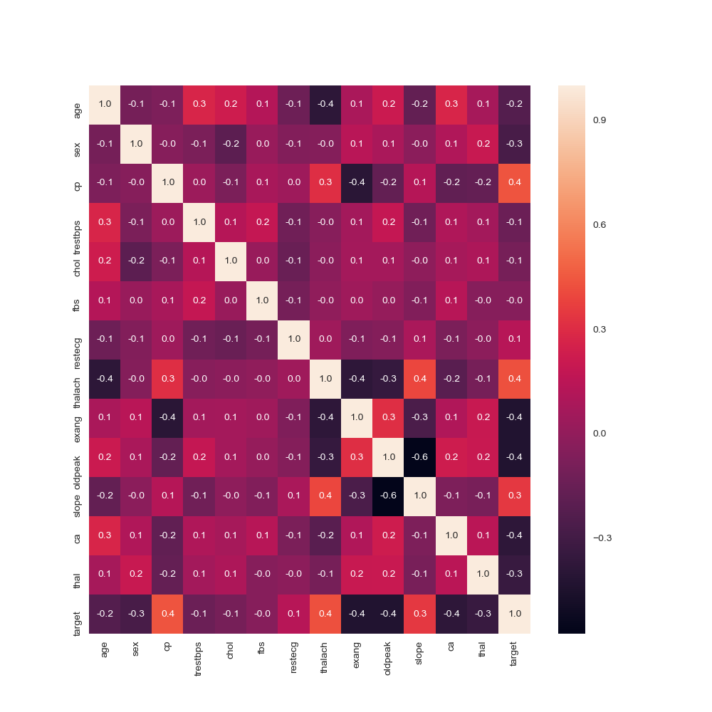
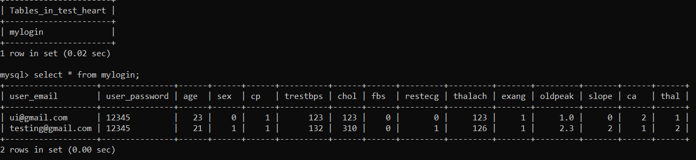
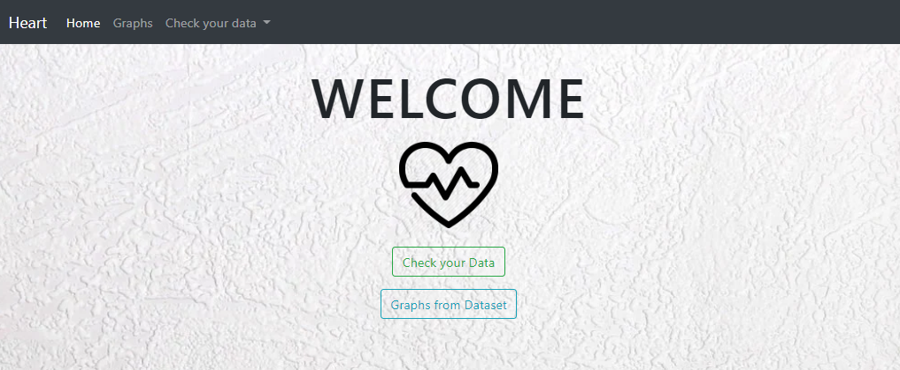
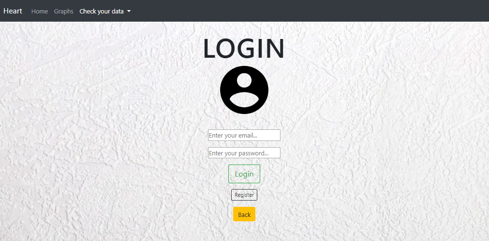
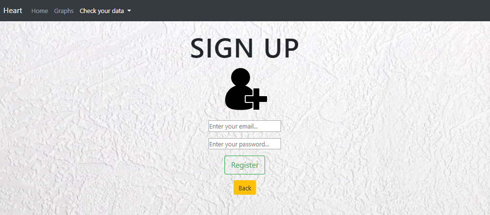
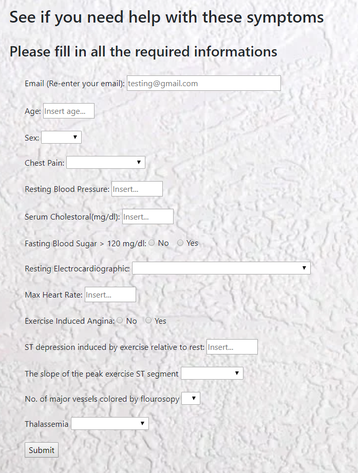
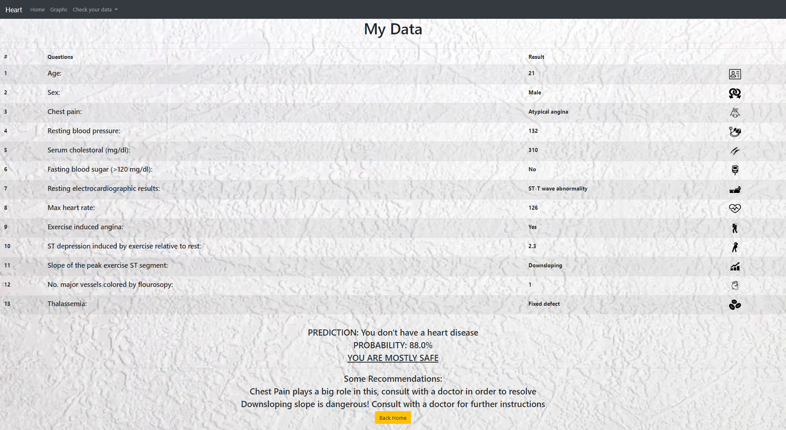
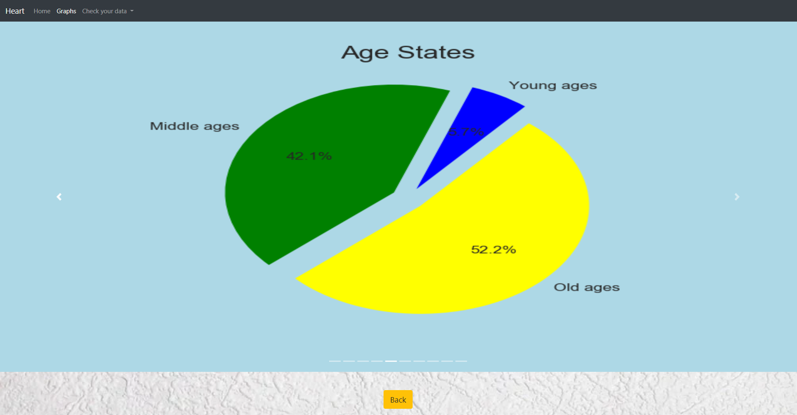
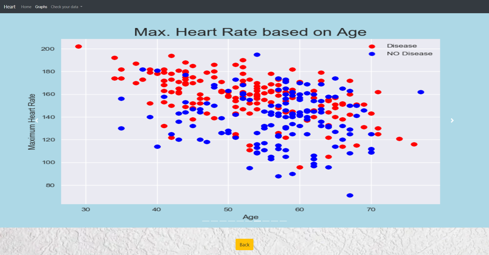

# HEART DISEASE PREDICTION

The CSV dataset is obtained from _**["Heart Disease UCI"](https://www.kaggle.com/ronitf/heart-disease-uci)**_ provided by Kaggle and there are 14 different attributes given in the data. Our main objective of this particular program is to let each patient predict whether they might have heart disease by the symptoms they are currently facing. 

Before heading to the pages below, I did a heatmap plot to see the correlation of each attributes:

```python
plt.figure(figsize=(10,10))
sns.heatmap(df.corr(), annot=True, fmt='.1f')     # thalach, CP, slope
```



Our target design is pretty straight forward as it encourages patients to navigate through the program with ease. The data of each patient that they input will be stored in MySQL server; so that if they want to access their previous data once more, they will be able to do so. 



1. Home Page

    The home page is pretty simple to access as there are only 2 buttons along with navigation bar in order for the patients to click:

    

2. Login Page
    
    When the patients click the _*Check your data*_ button, it will lead to the login page where they can access to their existing data (if they have registered before), if they input the wrong email/password or have not registered, there will be a flash message shown below the buttons.

    
    
3. Register Page

    If the patients have not registered before, they will have to click the _*Register*_ button and input their email and password; then they will be redirected to a Form page. In case of patients that have their email stored in the MySQL server before, they will be redirected back to login page with a flash message.
    
    
    
4. Form Page

    In this page, patients will be able to input all the required informations based on the symptoms that they are currently facing:
    
    
    
    All of the symptoms must be filled in accordingly or they won't be able to proceed to the result page.
    
5. Result Page

    Result page will be showing all the symptoms that the patients are having with prediction whether they might be facing heart disease or not. It also shows some recommendations on what they should improve on based on the heatmap done above:
    
    
    
6. Graphs Page

    Last but not least, the _*Graphs*_ button seen in the Home Page will lead to a slide show of graphs analysed from the datasets. Its purpose is to identify patterns, here are some examples of the graphs:
    
    
    
    

### **_Enjoy!_**